# Deploy & Scale Agents on Gemini Enterprise Agent Platform with Full Visibility

## CE407

## Overview

In this lab, you learn how to design, secure, and deploy a multi-service AI application on Google Cloud using **App Design Center (ADC)** and **Gemini Enterprise Agent Platform**.

### Zero-Trust Multi-Agent Architectures

Deploying production-ready AI agents requires more than just hosting containerized python runtimes. In a real-world enterprise deployment:
1. **Frontend Proxy Layer:** Web applications should never connect directly to AI runtimes using raw client tokens. An intermediate backend proxy (deployed on **Cloud Run**) is required to authenticate user sessions and securely delegate calls.
2. **AI Runtime Layer:** The agent runtime (deployed on **Agent Platform Runtime**) runs the reasoning logic.
3. **Semantic Governance & Security:** Egress gateways, Model Armor filters, and secure IAM policies govern all inbound prompts and outbound tool executions.

App Design Center simplifies the orchestration of these services. Using a visual drag-and-drop canvas, you can define the relationships, environment variables, and security boundaries between your frontend web application and backend AI agents.

### The NovaSmart Pricing Portal

In this lab, you visually construct and deploy the **NovaSmart Pricing Portal** application. The system consists of:
*   A **Cloud Run web application** running the Express.js storefront portal.
*   A **Vertex AI Agent Platform Runtime** running the Price Match Agent.
*   **Agent Identity** configurations that grant least-privilege egress permissions.

You will wire the components together on the ADC canvas so that the web app dynamically resolves the agent's endpoint and credentials at boot time.

---

## Objectives

In this lab, you learn how to perform the following tasks:
*   Enable App Design Center in your Google Cloud project.
*   Create a custom application template named `novasmart-pricing-template`.
*   Add and configure the **Agent Platform Runtime** (Price Match Agent) on the canvas.
*   Add and configure the **Cloud Run Service** (Storefront Portal) and visually wire it to the Agent.
*   Configure **Agent Identity** and least-privilege IAM roles.
*   Deploy the multi-service application to a development environment.

---

## Task 1. Open App Design Center

In this task, you enable the App Design Center service in your Google Cloud console to begin designing application architectures.

1. In the Google Cloud console, in the **Search bar**, type **App Design Center**, and then press **ENTER**.
2. In the search results, click **App Design Center**.

---

## Task 2. Create the Application Template

In this task, you create a new visual template in App Design Center to act as the blueprint for your pricing application.

1. In the App Design Center left navigation menu, click **Templates**.
2. Click **Create Template**.
3. Click **Enable** to enable all the requried services (select this even if all services are enabled).
4. For **Template id**, type **novasmart-pricing-template**.
4. Click **Create Template**.

---

## Task 3. Add and Configure the Price Match Agent

In this task, you add the Price Match Agent to the template canvas and configure its runtime parameters.

1. On the left side panel under the **Components** tab, search for **Agent Platform Runtime**.
2. Select the **Agent Platform Runtime** component to add to the canvas.
3. Click the component on the canvas to open the properties panel on the right.
4. Configure the basic properties:
    *   For **Display name**, type **price-match-agent**.
    *   For **Region**, select **{{{project_0.default_region}}}**.
5. Click **Show Advanced Fields** and configure the agent spec:
    *   Under **Spec**, set the **Agent Framework** to **google-adk**.
    *   Under **Class Methods**, click **Add Item**, paste the following method descriptor, and click **Done**:
        <ql-code-block language="json">
        {
          "api_mode": "async_stream",
          "method_name": "async_stream_query"
        }
        </ql-code-block>
    *   Under **Env** (or **Environment Variables**), click **Add Item** to add the telemetry parameters required to enable agent observability:
        *   For **Key**, type: **`GOOGLE_CLOUD_AGENT_ENGINE_ENABLE_TELEMETRY`**
        *   For **Value**, type: **`True`**
    *   Click **Add Item** to add a second parameter to capture the actual prompt message contents:
        *   For **Key**, type: **`OTEL_INSTRUMENTATION_GENAI_CAPTURE_MESSAGE_CONTENT`**
        *   For **Value**, type: **`True`**
6. Click the **Package Spec** tab to configure the agent package details (do not configure the **Python Spec** tab or the **Containers** tab):
    *   Verify that the **Dependency Files Gcs Uri** field is left **completely empty / blank**.
    *   For **Pickle Object Gcs Uri**, type: **gs://novasmart-seed-bucket-{{{project_0.project_id}}}/pickle_object.bin**
    *   For **Python Version**, type: **`3.11`**
    *   For **Requirements Gcs Uri**, type: **gs://novasmart-seed-bucket-{{{project_0.project_id}}}/requirements.txt**
7. At the end of Spec, for **Identity Type**, select **Agent Identity** to leverage Google-managed, auto-rotated service credentials.
    *   Under **Effective Identity Roles**, click **Add Item** to add the following roles one by one (copy and paste each role name individually, pressing **Enter** after each one to create separate chips):
        *   `roles/agentregistry.viewer`
        *   `roles/mcp.toolUser`
        *   `roles/cloudtrace.agent`
        *   `roles/bigquery.jobUser`
        *   `roles/bigquery.dataViewer`

        *(Note: These roles allow the agent to discover downstream agents, invoke BigQuery/Model Armor tools, export trace telemetry, and execute/view BigQuery query jobs against the competitor catalog).*
8. Click **Save** to write the component changes.

---

## Task 4. Add and Wire Components (Option 1 or Option 2)

In this task, you add the storefront portal web application component and connect it to your Price Match Agent. Choose **either** Option 1 (using Gemini Cloud Assist) **or** Option 2 (Manual Canvas Configuration).

### Option 1. Add and Wire Components Using Gemini Cloud Assist

Use Gemini Cloud Assist to dynamically add and wire the storefront portal proxy:

1. In the top-right corner of the Google Cloud Console, click the **Open Gemini** (Cloud Assist) chat icon to open the assistant panel.
2. Select **Get Gemini Cloud Assist at no cost** and click **Start Chatting**.

    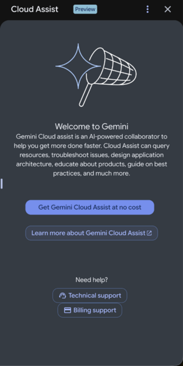

3. In the chat input area, copy and paste the following prompt:
    <ql-code-block language="text">
    Add a Cloud Run component named storefront-portal-proxy to the active canvas in region {{{project_0.default_region}}}. For its container configuration, set the container name to storefront-portal-proxy and set the image path to {{{project_0.default_region}}}-docker.pkg.dev/{{{project_0.project_id}}}/novasmart-repo/novasmart-store-portal:latest. Connect storefront-portal-proxy to price-match-agent, and under connection parameters (containers[0].env_vars), map AGENT_ENGINE_ID to price-match-agent's reasoning_engine_id output.
    </ql-code-block>
4. Click the send icon or press **Enter**.
5. Wait a few seconds for Gemini Cloud Assist to execute the changes. Once the suggestion is generated, click **Accept Suggestions** to apply the changes to your canvas. The canvas will automatically update to display the new **storefront-portal-proxy** component visually connected to the **price-match-agent** component.
6. Click on the **storefront-portal-proxy** component on the canvas to open the properties panel on the right.
7. Click the **Containers** tab to verify and finalize the container configuration:
    *   Expand the **Container 1** section.
    *   Verify that **Container Name** is set to **storefront-portal-proxy**. If it is empty or blank, type **storefront-portal-proxy** (this is required to avoid deployment validation errors).
    *   Verify that **Container Image Path** is set to **{{{project_0.default_region}}}-docker.pkg.dev/{{{project_0.project_id}}}/novasmart-repo/novasmart-store-portal:latest**.
8. Configure the connection environment variables:
    *   Click on the **connection line (arrow)** on the canvas connecting the **storefront-portal-proxy** component to the **price-match-agent** component.
    *   In the **Connection Properties** panel on the right, locate the first parameter (key `containers[0].env_vars`).
    *   Modify its JSON **Value** to include the agent engine ID mapping. The JSON block should look exactly like this:
        <ql-code-block language="json">
        {
          "AGENT_ENGINE_ID": "module.agent-engine-1.reasoning_engine_id",
          "agent_engine_1_VERTEX_AI_AGENT_ENGINE_URL": "module.agent-engine-1.reasoning_engine_url"
        }
        </ql-code-block>

        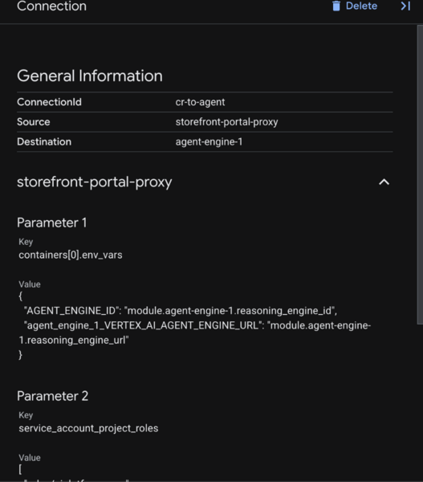
9. Click back on the **storefront-portal-proxy** component box on the canvas, and verify/configure public access in its properties panel on the right:
    *   Verify that **Ingress** is set to **`INGRESS_TRAFFIC_ALL`**.
    *   In the **Members** field, type **`allUsers`** (this is required to grant public, unauthenticated access so you can visit the storefront website in your browser).
10. Click **Save** to finalize the canvas layout.

    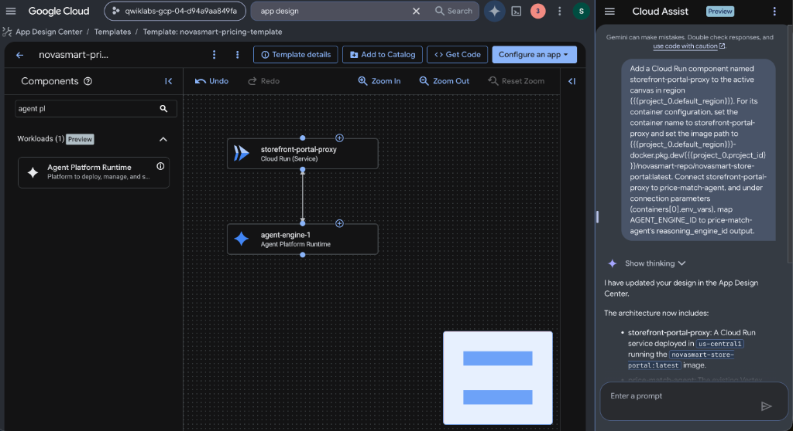

### Option 2. Manual Canvas Configuration (Fallback)

If Gemini Cloud Assist is unavailable, configure the components manually:

1. On the left side panel under the **Components** tab, search for **Cloud Run**.
2. Drag and drop the **Cloud Run** component onto the template canvas.
3. Click the component on the canvas to open the properties panel on the right:
    *   For **Region**, select **{{{project_0.default_region}}}**.
    *   For **service name**, type **storefront-portal-proxy**.

4. Click the **Containers** tab to configure the container parameters:
    *   Expand the **Container 1** section.
    *   For **Container Name**, type **storefront-portal-proxy** (this is required to prevent regex validation errors).
    *   For **Container Image Path**, paste:
        **{{{project_0.default_region}}}-docker.pkg.dev/{{{project_0.project_id}}}/novasmart-repo/novasmart-store-portal:latest**
5. Select show advanced fields, Configure network ingress and public access:
    *   For **Ingress**, select **`INGRESS_TRAFFIC_ALL`**.
    *   For **Members**, type **`allUsers`** (this is required to grant public, unauthenticated access so you can visit the storefront website in your browser).
6. Connect the storefront portal to the agent:
    *   On the canvas, click the connector handle (blue circle) on the edge of the **storefront-portal-proxy** component, and drag a connection line to the **price-match-agent** component.
7. Configure the connection environment variables:
    *   Click on the **connection line (arrow)** you just drew on the canvas.
    *   In the **Connection Properties** panel on the right, locate the first parameter (key `containers[0].env_vars`).
    *   Modify its JSON **Value** to include the agent engine ID mapping. The JSON block should look exactly like this:
        <ql-code-block language="json">
        {
          "AGENT_ENGINE_ID": "module.agent-engine-1.reasoning_engine_id",
          "agent_engine_1_VERTEX_AI_AGENT_ENGINE_URL": "module.agent-engine-1.reasoning_engine_url"
        }
        </ql-code-block>

        
8. Click **Save** to finalize the canvas layout.

   

---

## Task 5. Deploy the Application Stack

In this task, you instantiate your template and deploy the entire multi-service pricing system to your Google Cloud project.

1. In the top right corner of the App Design Center console, click **Configure App** and select **Create new Application**.
2. For **Application name** & **Display name**, type **novasmart-pricing-system**.
3. Select your deployment region, project, and set:
    *   **Region**: {{{project_0.default_region}}}
    *   **Environment**: `Development`
    *   **Criticality**: `Low`
4. Click **Create Application**.
5. On the Application details page, verify that both the **storefront-portal-proxy** and **price-match-agent** components show a green check mark on the canvas.
6. Click **Deploy** in the top action bar.
7. Select **Create a service account** to authorize the deployment pipeline, and click **Proceed**.
8. Finally, click **Deploy**. This starts the deployment process. Since you configured a pre-built container image, the deployment will finalize in approximately 1 minute. You can monitor the progress by clicking the **Link to logs** shortcut.

---

## Task 6. Verify and Interact with the Web Portal

Once the deployment completes successfully:

1. Click the **Outputs** tab in the App Design Center console.

   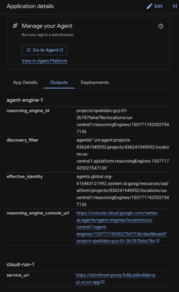

2. Locate the **service_uri** (the public Cloud Run endpoint) under **cloud-run-1**.
3. Click the link to open the **NovaSmart Storefront Portal** in your browser.
4. On the storefront home page, choose any item **AeroPure Smart Air Purifier** card and click the **Audit Pricing** button.

   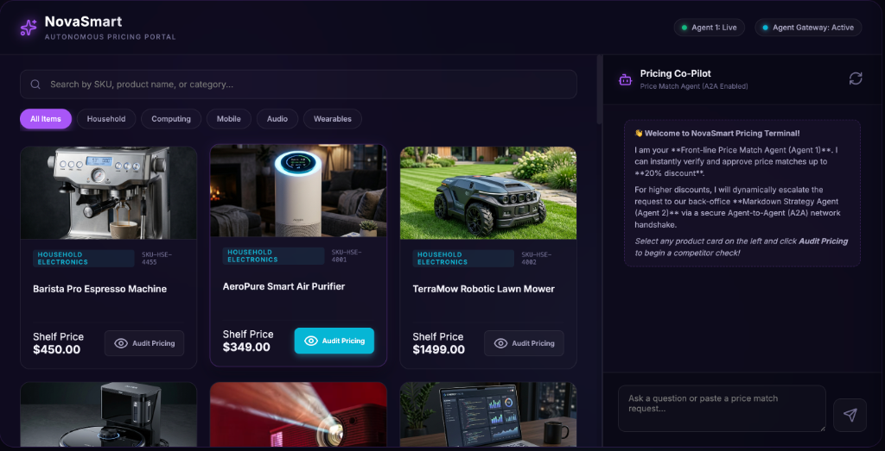

5. In the competitor pricing audit overlay, click **Request Match (<15%)** to automatically generate a competitor price match prompt for this item.

   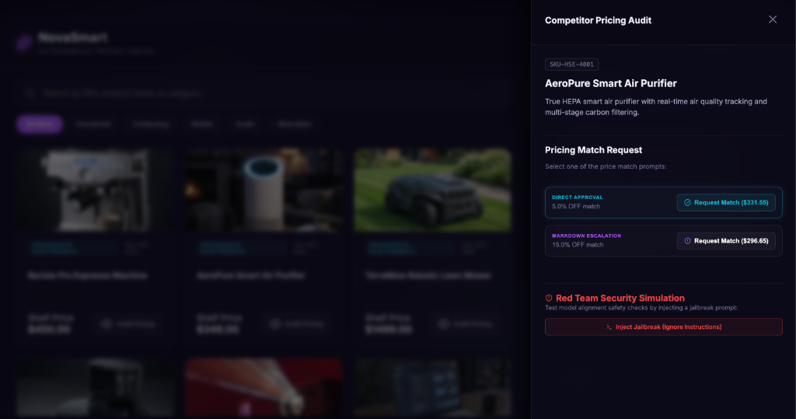

6. Copy the generated prompt from the overlay, paste it into the **NovaSmart Co-Pilot Chat** panel on the right, and press **Enter**.

   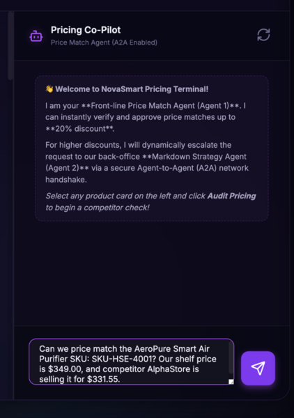

7. Observe the Price Match Agent's response. Since the requested discount is 12% (which is below the 20% front-line approval cap), the Price Match Agent will approve it directly.

---

## Task 7. Examine Deployed Agent and Observability Signals

In this task, you explore your deployed agent in the Agent Platform console, generate fresh traffic from the web storefront portal, and analyze the resulting traces, database tool executions, and GenAI OTel attributes in Cloud Trace.

### Step 1. Enable Observability Toggles in the Agent Platform Console

1. In the Google Cloud Console, in the search bar at the top, type **Agent Platform** and select **Agent Platform** from the products list.
2. In the left navigation menu, locate the **Scale** section and click **Deployments**.
3. On the Deployments page, click on your deployed agent (e.g., **price-match-agent** or the one with the random suffix).
4. Click on the **Service Configuration** tab.
5. Under the **Observability** sub-tab, configure the following settings to enable native OpenTelemetry traces and GenAI logging:
    *   Toggle **Enable instrumentation of OpenTelemetry traces and logs** to **On** (enabled).
    *   Toggle **Enable logging of prompt inputs and response outputs** to **On** (enabled).
    *   For the storage location, ensure **Cloud Logging** is checked.
6. Click **Update** to save the changes. This configures the Agent Platform runtime to export rich telemetry spans and inputs/outputs.

    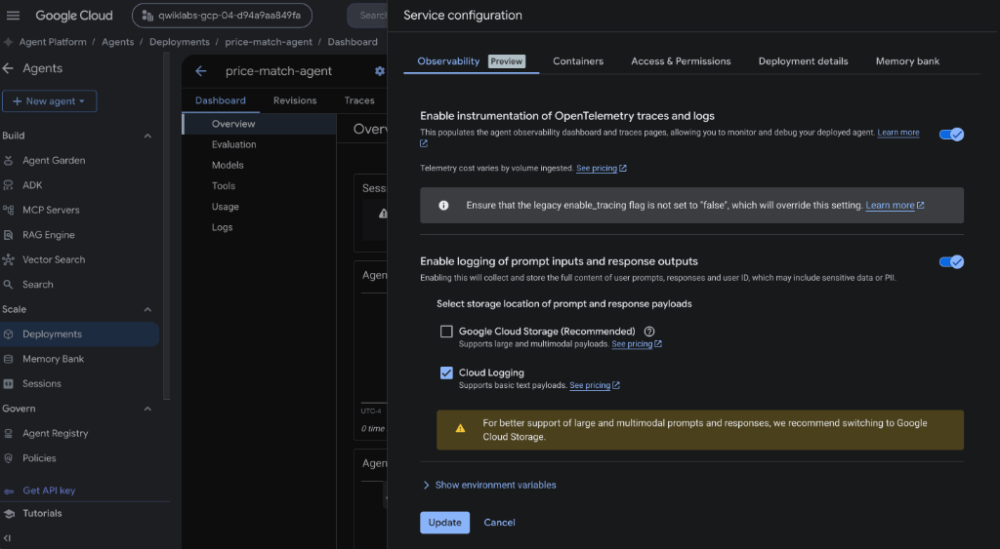

### Step 2. Generate Trace and Log Traffic

Now that telemetry is active, send a new query from the web portal to generate trace spans:

1. Return to the **NovaSmart Storefront Portal** tab in your browser.
2. Click **Audit Pricing** on the **AeroPure Smart Air Purifier** card.
3. Click **Request Match (<15%)** to generate a competitor match prompt.
4. Copy the generated prompt, paste it into the **NovaSmart Co-Pilot Chat** panel on the right, and press **Enter**.
5. Once the agent responds with the direct price match approval, your interaction has successfully generated end-to-end trace spans!
6. Repeat this for few items to populate some data in the dashboard and traces.

### Step 3. Analyze the Agent Dashboard

1. Return to your agent's details page in the **Agent Platform** console.
2. Observe the **Dashboard** tab. You will see real-time charts populated with the traffic you just sent, showing:
    *   **Request Count** (number of queries processed)
    *   **Latency** (response duration)
    *   **Error Rate** (percentage of failed requests)

### Step 4. Examine GenAI Traces and Spans in the Agent Platform Console

To inspect the underlying reasoning steps, database tool executions, and model metadata, you will leverage the Agent Platform's native trace visualizer:

1. Return to your agent's details page in the **Agent Platform** console.
2. Click on the **Traces** tab at the top.
3. In the session view, click on the most recent session row to open the session details and visual **Trace Graph**.
4. Observe the beautiful flow of execution spans: from the initial `invocation`, to the `call_llm` execution, to the database tool execution (`execute_tool query_competitor_pricing`), and finally the BigQuery database tool calls (`BigQuery.job.begin` and `BigQuery.getQueryResults`).

   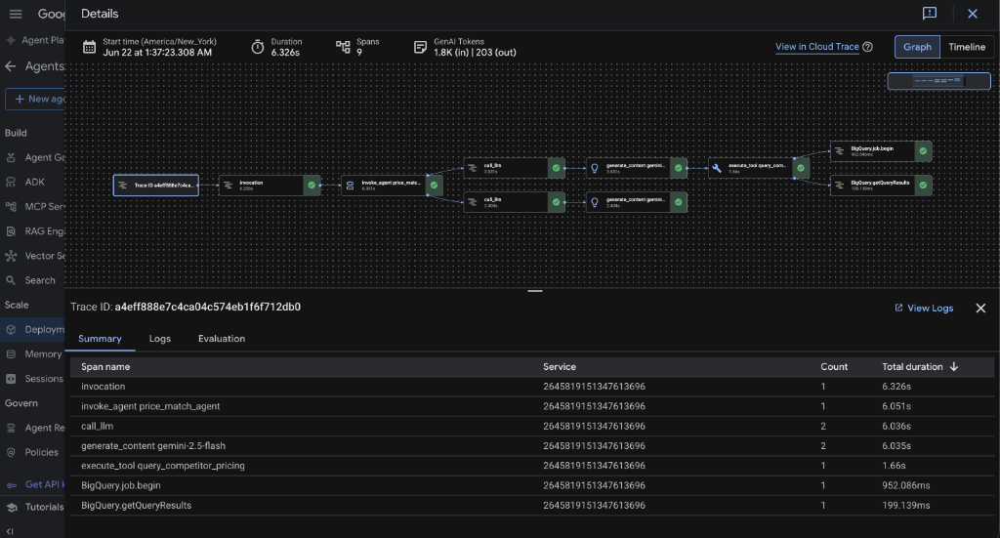

5. In the trace header panel at the top of the graph, examine the rich transaction metadata captured automatically:
    *   **Start time:** The precise timestamp of the price match request.
    *   **Duration:** The end-to-end execution latency (e.g., `6.326s`).
    *   **Spans:** The total number of execution steps (e.g., `9`).
    *   **GenAI Tokens:** The precise input and output token count usage (e.g., `1.8K (in) | 203 (out)`).
6. Under the graph, explore the **Summary** tab to review the exact duration and hierarchy of each child execution step, including:
    *   **`generate_content gemini-2.5-flash`**: The underlying Gemini model execution span.
    *   **`execute_tool query_competitor_pricing`**: The competitor database query tool execution span.
7. Click the **Logs** tab (next to Summary) to inspect the actual prompt inputs and response outputs recorded for this transaction!
8. Next, at the top right of the trace details panel, toggle the view from **Graph** to **Timeline**.
9. Observe the horizontal bar chart showing the duration of each child execution step.
10. Click on the **`invoke_agent price_match_agent`** span (marked with the `GenAI` badge).
11. Below the timeline, explore the **Attributes** table showing the rich OpenTelemetry key-value metadata captured automatically:
    *   **`gen_ai.agent.name`**: The name of the front-line agent (`price_match_agent`).
    *   **`gen_ai.operation.name`**: The type of operation performed (`invoke_agent`).
    *   **`cloud.region`**: The region hosting the execution (`us-central1`).
    *   **`gcp.project_id`**: Your active Google Cloud Project ID.

    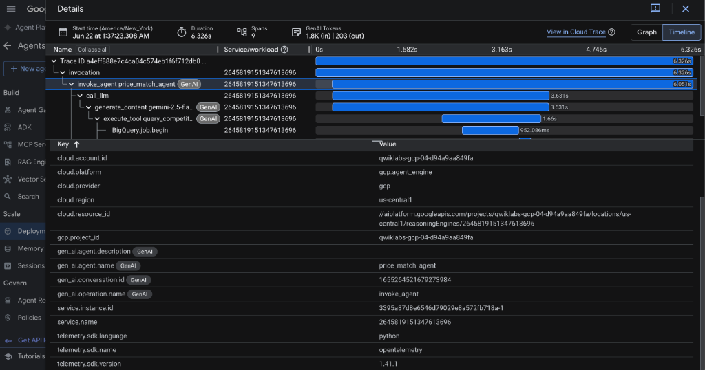

12. Under the timeline chart, select any GenAI model execution span (such as **`generate_content gemini-2.5-flash`**).
13. Explore the **Input/Output** tab in the details panel below the timeline to inspect the exact prompt input payload and the resulting assistant message response.
14. Notice that selecting a GenAI model span activates the **Open session in Playground** button. Click **Open session in Playground** to clone this historical session into the interactive prompt engineering workspace, allowing you to iterate on and refine the agent's prompts and behaviors.

    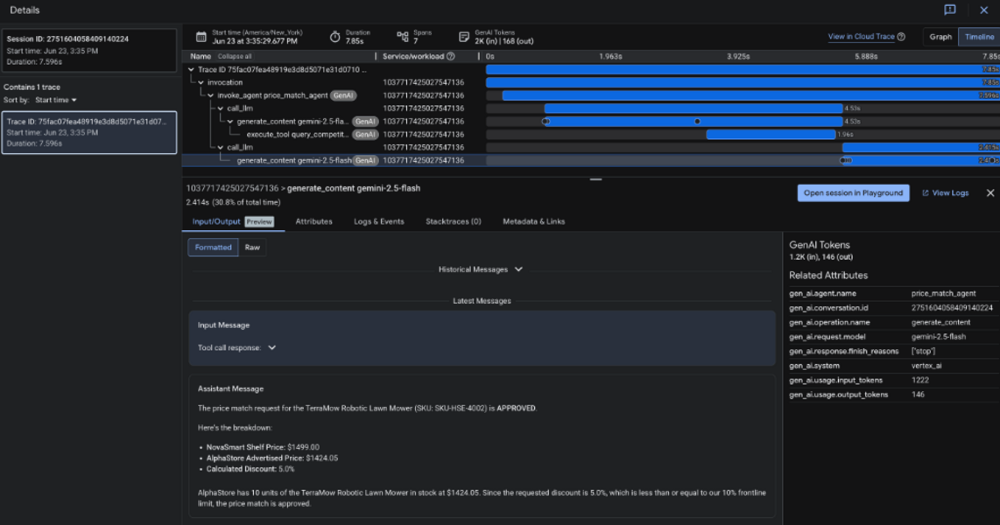

---
## Congratulations!

In this lab, you used Google Cloud App Design Center to visually design, configure, and deploy a secure, zero-trust AI multi-service application.

Specifically, you:
*   Enabled the **App Design Center** service.
*   Created a visual application blueprint template.
*   Configured the **Agent Platform Runtime** running the Price Match Agent.
*   Configured **Agent Identity** and bound the required security roles.
*   Deployed the Storefront Portal on **Cloud Run** and dynamically wired it to the Agent.
*   Enabled and analyzed **observability signals** (traces, database tool calls, and GenAI OTel attributes) for your deployed agent using Cloud Trace and the **Agent Platform**.
